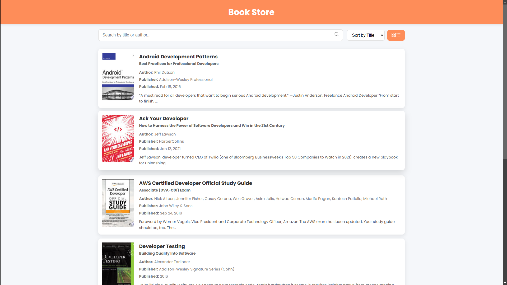
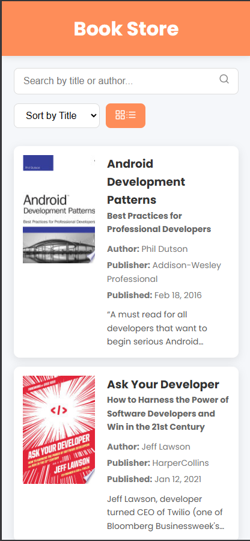

# Book Library Website

This is a simple Book Library web app that fetches books from [FreeAPI.app](https://freeapi.hashnode.space/api-guide/apireference/getBooks) and displays them in a user-friendly way. It allows users to browse books, switch between list and grid views, search by title/author, sort by title or release date, and navigate through paginated results.

## Tech Stack
- HTML
- CSS
- JavaScript

## Features
- 📚 **Fetch & display books** dynamically from the API
- 🔄 **Toggle between grid & list views**
- 🔍 **Search bar** to filter books by title/author
- 🔢 **Sort books** alphabetically or by release date
- 📖 **Pagination** to load more books
- 🔗 **Click on a book** to open more details in a new tab

## API Used
**Endpoint:** `GET https://api.freeapi.app/api/v1/public/books`

## Screenshots 📸

## Deployment 🌐
[Click here](https://book-store-ten-theta.vercel.app/)

## Setup & Usage
1. Clone the repo
2. Open `index.html` in a browser
3. Start exploring books!

## To-Do / Future Improvements
- Add loading indicators while fetching data
- Improve UI/UX with better styling
- Implement infinite scroll instead of pagination

